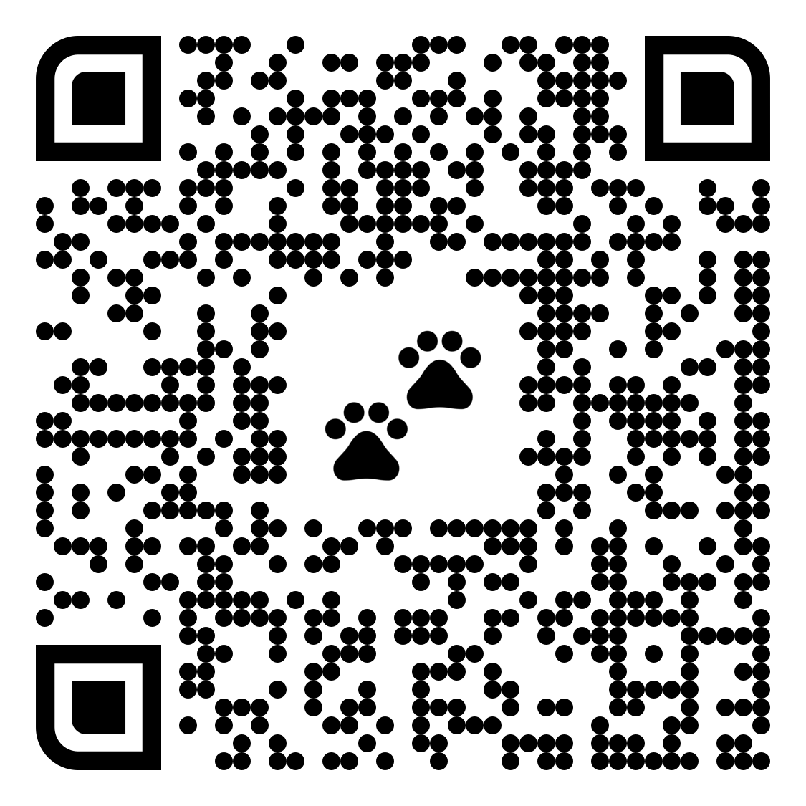
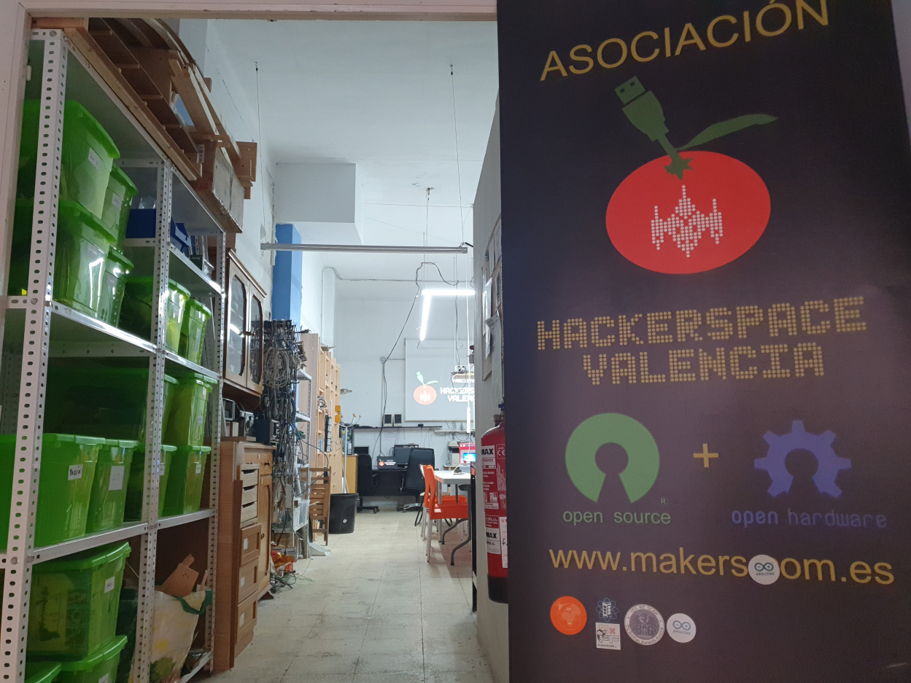
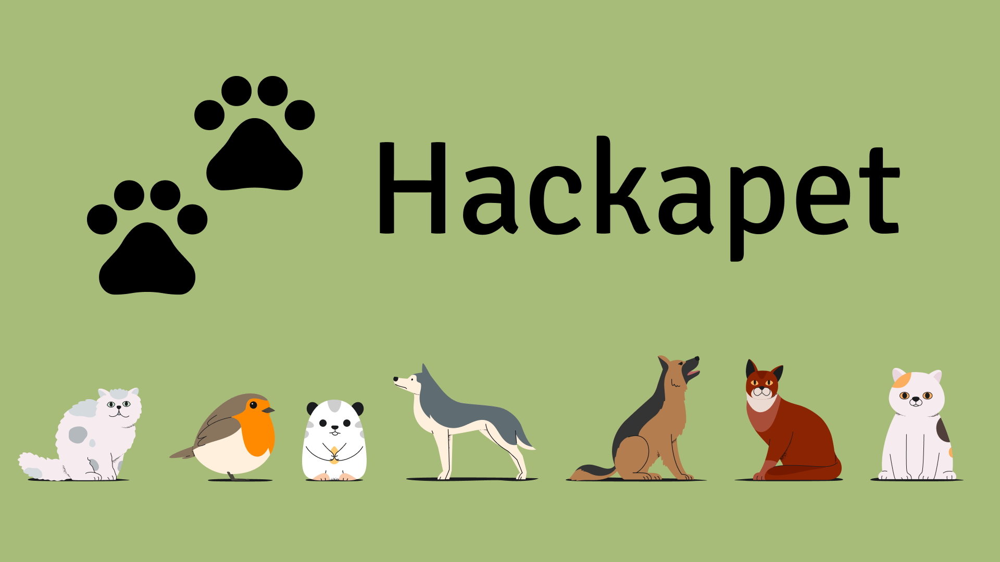
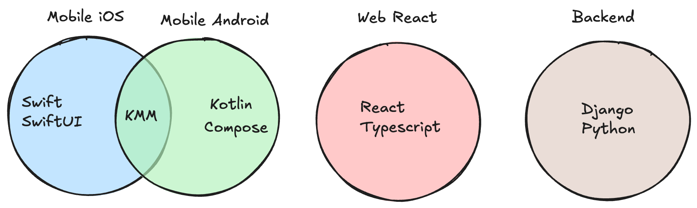
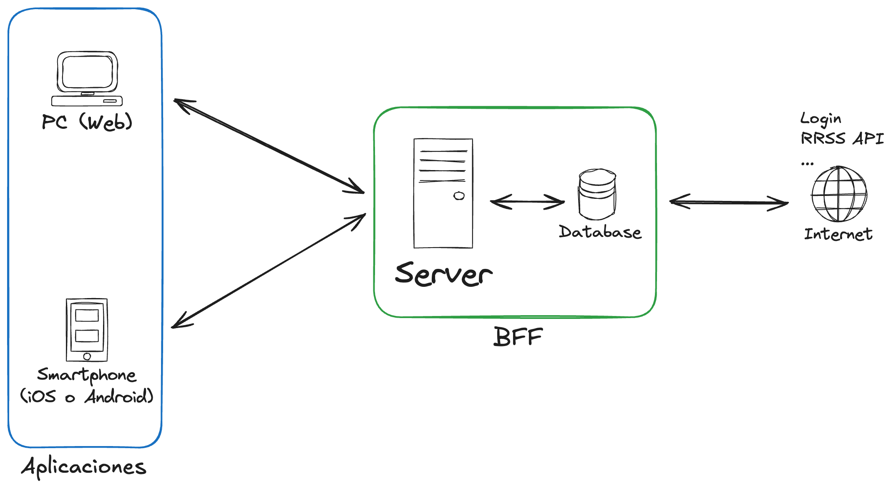
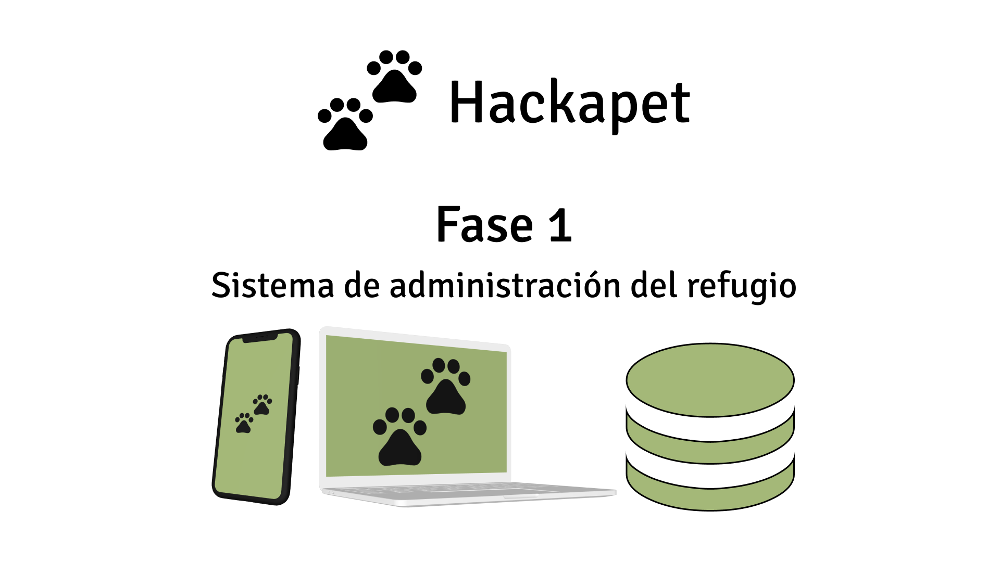
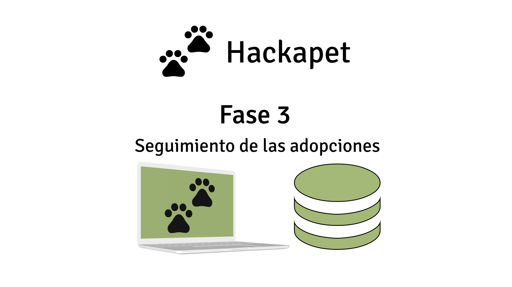

# Copia de estas diapositivas

Puedes encontrar una copia de estas diapositivas en el siguiente enlace:

[https://github.com/hackapet-project/org-slides](https://github.com/hackapet-project/org-slides)

{width=0.5\textwidth}

---

# ¿Qué veremos en esta introducción?

1. ¿Qué es hackapet? ¿Por qué lo hacemos?
2. Introducción breve.
3. Las fases.
4. Colaboración y comunicación con las protectoras.
5. Cómo nos organizaremos. El modelo híbrido.
6. Cómo va a funcionar cada plataforma.
7. Debate sobre la organización y preguntas.

---

{width=1\textwidth}

---

# Presentación entre nosotros

- Quién soy
- Qué hago laboralente/estudio.
- Por qué estoy aquí.

---

# ¿Qué es Hackapet? ¿Por qué lo hacemos?

{width=1\textwidth}

---

# Introducción breve

## Hackapet es
Un proyecto **sin ánimo de lucro y de código abierto** que desarrolla herramientas digitales para **optimizar la gestión en refugios de animales y facilitar las adopciones.**

- Somos voluntarios.
- Colaboramos con una buena causa.
- Aprendemos entre nosotros y de gente con mucha más experiencia.
- Trabajamos en equipo.
- Ganamos experiencia y podemos ponerlo en nuestro portfolio.

---

{width=1\textwidth}

---

{width=1\textwidth}

---

# Las fases.

## El proyecto se divide en 3 fases
* Se harán por orden de dificultad y en función de cuanta gente seamos.
* La segunda fase se hará al final ya que es la más importante y grande.
* Habrán deadlines para cumplir, pero para los P.O.

---

{width=1\textwidth}

---

{width=1\textwidth}

---

{width=1\textwidth}

---

# Colaboración y comunicación con las protectoras

- Sin ellas esto no sería posible.
- Designaremos a una persona encargada de llevar las comunicaciones.
- Les daremos updates del progreso.
- Harán pruebas de la beta, una vez esté terminada.
- Nos dan feedback.

---

# Cómo nos organizaremos. El modelo híbrido.

## ¿Qué es el modelo híbrido?

## Podemos dividirnos en tres grupos:
- Los habituales, los que estamos a largo plazo.
- Contribuidores esporádicos en sesiones de puertas abiertas.
- Contribuidores online de Github/Gitlab.

---

# Los habituales, a largo plazo

- Sprints de un mes.
- Accountable.
- Weelky meetings.
- Organizados más metículosamente.
- Estable.

---

# Puertas abiertas

- No hace falta que colaboren más de una sesión.
- Esta sesión será una vez al mes, en un meetup en el Hackerspace.
- Es para introducir a la gente a los problemas que nos encontramos en Hackapet.
- Mob Programming / Peer programming.
- Objetivo conseguir que más gente se una.

---

# Contribuidores online de todo el mundo

- Revisaremos las PRs
- Reconocimiento de su trabajo.

---

# Para resumir

- Sprints de un mes para los contribuidores regulares.
- Sesiones mensuales para presentar nuestro trabajo a nueva gente y plantar la semilla de Hackapet. Plantear problemas y resolverlos en directo.
- Weekly meetings para revisar el progreso de nuestro trabajo.

---

# Plataformas

1. Frontend:
    - P.O: Fernando Sanjuan
    - Tech Lead: Ignacio Delgado
2. Backend:
    - P.O. Fernando Sanjuan
    - Tech Lead: Fernando Sanjuan
3. iOS:
    - P.O: Felipe Gadea
    - Tech Lead: Felipe Gadea
4. Android:
    - P.O: Felipe Gadea
    - Tech Lead: Ignacio Delgado

---

# Debate sobre cómo organizar el proyecto y preguntas

## Te escuchamos!